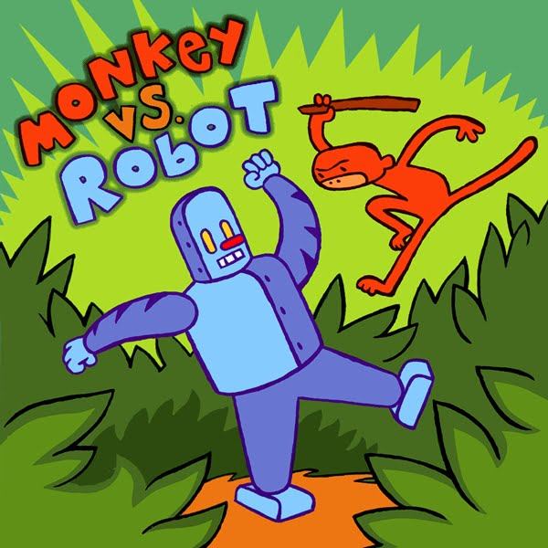
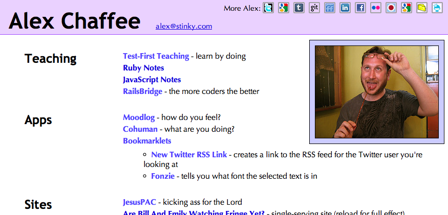

!SLIDE image

_Monkey vs. Robot_ comix and album by James Kochalka Superstar

# Monkey vs. Robot

## or, You Are Not An Object-Oriented Programmer

* by Alex Chaffee @alexch
* Thanks to Corey, Jeff for broaching the subject

# The Dog

## aka The Hacker
* "Go get it!"
* Keep typing till it works

# The Monkey
## Manual Objects

* Reach into an object, manipulate values, stuff results back in
  * or into a different object
<!-- * Reduces objects to mere structs
  * e.g thin models
* aka Procedural or Structural or Functional Programming -->
* Important, basic, ancestral problem-solving technique

# The Robot
## Verbal Programming

* Tell an object what you want
* Let it do it for you
* Easier to use
* Harder to create

Everyone who's used a good API knows how great it is; everyone who's created an API knows how hard it is

# In Short

> Procedural code gets information then makes decisions. Object-oriented code tells objects to do things. 
— Alec Sharp, Smalltalk by Example

# It's Okay Not To Be Object-Oriented

## Be inclusive of diversity!

* There are lots of valid ways to program
* But you should know what you're missing

# What's so great about objects?

* encapsulation
* polymorphism
* isolation
* modularity
* testability
* inheritance

[Wikipedia on Object-oriented Programming](http://en.wikipedia.org/wiki/Object-oriented_programming)

# What's so bad about not using objects?

* If you're not really using objects, you may *think* you're getting the benefits of OO
* ...but you may not be!
  * e.g. closures are **awesome** but they inherit scope, which violates isolation

# Some Things That Are Not Objects

* Templates
  * ERB
  * HAML
* Regular Expressions
* Closures
* Switch Statements
  * including `respond_to`
* Modules (?)
* Presenters (?)

# OO slogans:

  * "Tell, don't ask"
    * <http://pragprog.com/articles/tell-dont-ask>
  * "Only talk to your friends" (The Law Of Demeter)
    * <http://en.wikipedia.org/wiki/Law_of_Demeter>

# Lovely Demeter, Meter Maid

> "The project was named in honor of Demeter, “distribution-mother” and the Greek goddess of agriculture, to signify a bottom-up philosophy of programming which is also embodied in the law itself.

# Law of Demeter for Methods

* any method of an object should only call methods belonging to:
  * itself
  * any parameters that were passed in to the method
  * any objects it created
  * any composite objects

# Rule Of Thumb

* Don't use too many dots
* Put your dots on the left side
  * `dog.speak` vs `puts dog.thing_to_say`

# Tell Don't Ask example

    SortedList thingy = someObject.getEmployeeList();
    thingy.addElementWithKey(foo.getKey(), foo);

> This is what we are trying to prevent. (We also have an example of Asking instead of Telling in foo.getKey()). Direct access of a child like this extends coupling from the caller farther than it needs to be. The caller is depending on these facts:

* someObject holds employees in a SortedList.
* SortedList’s add method is addElementWithKey()
* foo’s method to query its key is getKey()

> Instead, this should be:

    someObject.addToThingy(foo);

>     Now the caller is only depending on the fact that it can add a foo to thingy, which sounds high level enough to have been a responsibility, not too dependent on implementation.

# Refactoring To Objects

"Brevity is often a side-effect of refactoring, but it's not the goal… the goal is to make the implementation fade away." -@j3 #gogaruco

# Refactoring To Objects: Iconistan

* http://alexchaffee.com
* http://github.com/alexch/alexch.github.com

# API

    @@@ruby
    def iconistan
      widget Iconistan, :sites =>
      [
        "http://twitter.com/alexch",
        "http://google.com/profiles/alexch",
        "http://tumblr.com/alexch",
        "http://github.com/alexch",
        "http://friendfeed.com/alexch",
        "http://linkedin.com/in/alexchaffee",  
        "http://facebook.com/daycha",
        "http://flickr.com/photos/alexchaffee/",
        "http://pivotallabs.com/users/alex/blog",
        "http://google.com/reader/shared/alexch",
        "http://stinky.com/alex",
        "http://foursquare.com/alexch"
      ]
      div "More Alex:", :class => "prefix"
    end

# Dog Style ("Go get it!")

    @@@ruby
    class Iconistan < Erector::Widget
      external :style, <<-CSS
      div.iconistan { position: relative; padding: 0px; margin: 0px 4px; }
      ...
      CSS
    
      needs :sites

      def content
        div :class => "iconistan" do
          @sites.each do |u|
            domain = u.match(/https?:\/\/([^.]*)\./)[1]
            div :class => "icon" do
              div :class => "icon_border" do
                a :href => u do
                  img :src => "icons/#{domain}.png", 
                    :height => 16, :width => 16
                end
              end
              text nbsp(" ")
              div :class => "url" do
                url u
              end
            end
          end
        end
      end
    end

# Monkey Style ("Gimme!")

    @@@ruby
    class Iconistan < Erector::Widget
      needs :sites
    
      class Site
        attr_reader :url, :domain, :img
        def initialize url
          @url = url
          @domain = url.match(/https?:\/\/([^.]*)\./)[1]
          @img = "icons/#{@domain}.png"
        end
      end

# Monkey Style cont.

    @@@ruby
      def sites
        @sites.map{|url| Site.new(url)}
      end

      def content
        div.iconistan do
          sites.each do |site|
            div.icon do
              div.icon_border do
                a :href => site.url do
                  img :src => site.img, :height => 16, :width => 16
                end
              end
              text nbsp(" ")
              div.url do
                url site.url
              end
            end
          end
        end
      end
    end

# Robot Style ("What is your order?")

    @@@ruby
    class Site < Widget
      def initialize url
        @url = url
        @domain = url.match(/https?:\/\/([^.]*)\./)[1]
        @img = "icons/#{@domain}.png"
      end
  
      def content
        div.icon do
          div.icon_border do
            a :href => @url do
              img :src => @img, :height => 16, :width => 16
            end
          end
          text nbsp(" ")
          div.url do
            url @url
          end
        end
      end
    end

# More Like This

  * [Unobtrusive Ruby](http://robots.thoughtbot.com/post/10125070413/unobtrusive-ruby)  
  * [Why You Should Care About Encapsulation](http://gmoeck.github.com/2011/09/20/why-you-should-care-about-encapsulation.html)
  * [Lovely Demeter, Meter Maid](http://pivots.pivotallabs.com/users/alex/blog/articles/273-lovely-demeter-meter-maid)

# Alex Who?

* [@alexch](http://twitter.com/alexch)
* [TestFirst.org](http://testfirst.org)
* [Erector](http://erector.rubyforge.org)
* [Wrong](http://github.com/sconover/wrong)
* [Whos](http://github.com/alexch/whos)

